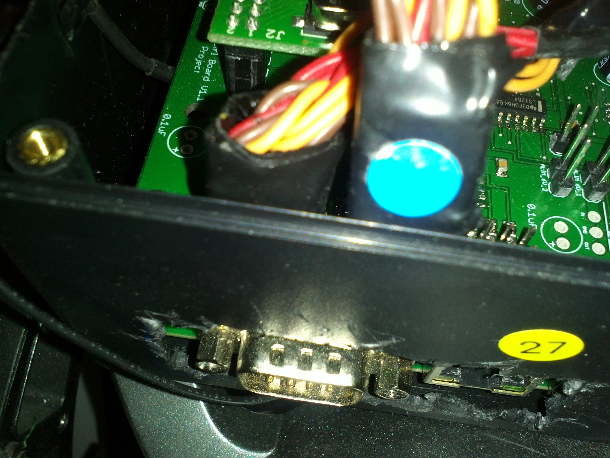

.. _changementU

Changement d'un U
=================

Il faut déposer le bras.

Pour cela, on commence par débrouiller la boite de com de ses fils, quitte à
couper quelques colliers (à remettre ensuite, on peut faire une photo avant
de les couper pour gagner du temps).

Ensuite :

* On dégage la boîte de son emplacement.

* On déconnecte les bus ttl et rs485

* On ouvre la boîte à l'aide d'un tournevis cruciforme

* On déconnecte le bus pwm (en notant bien le sens de rebranchement)

* On finit de dégager les câbles.

* On enlève les ressorts.

Avant d'enlever le U, il faut bien noter les correspondances entre zero
mécanique du servo (cf point sur l'axe étoilé) et la position du U, à l'aide
d'un marqueur par exemple. Il ne faut pas oublier de marquer les positions
pour chacune des fixations du U si d'autres fixations ne sont pas évidentes.
Cela facilite le remontage. Il faut garder à l'esprit que si le U n'est pas
remonté dans la bonne position, changer le zéro à l'aide de l'ordinateur ne
règle pas forcément tous les problèmes (Une position qui était valide peut se
retrouver dans la zone morte du potard et poser des problèmes du coup).
