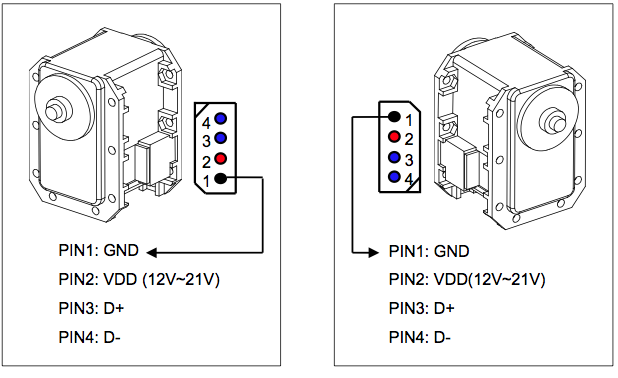
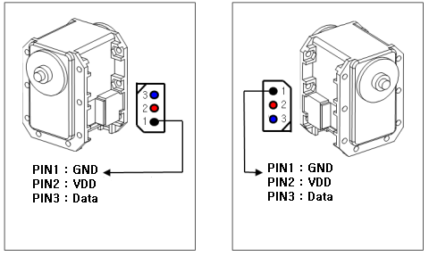

.. _configServo

Configuration d'un nouveau servo
================================

Pour configurer un nouveau servo, il est conseillé de brancher un seul servo à
la fois (pour éviter les pb de conflits d'Id, voir plus bas).

Attention, le branchement du servo comporte son alim et son signal (1 cable
signal dans le cas TTL (MX* en général) et 2 cables signal dans le cas RS485
(RX* en général))

Câblage RS485 (4 pins):

Câblage TTL (3 pins):

Il faut bien veiller à ce que la source d'alimentation puisse fournir 
suffisamment:

* si le servo est branché à une carte de comm Rhoban, il n'y a aucun problème.

* avec un USB2Dynamixel c'est un peu plus compliqué: il ne faut surtout pas
  alimenter le servo avec le port USB de l'ordinateur (un Mac a déjà succombé
  comme ça).
  Donc, ca veut dire qu'il faut 2 cables:
  
  * 1 qui alimente (câble dynamixel standard sur lequel on a coupé le signal)
  
  * 1 qui transporte le signal (câble dynamixel standard sur lequel on a coupé
    V+)
  
  On branche le cable signal sur l'usb2dynamixel. Puis, on branche le cable
  d'alim sur n'importe quelle source d'alimentation (alim stabilisée,
  ou n'importe quoi d'autre qui fournit au moins 12V). **Attention, ne pas
  alimenter à l'envers sous peine de fumer le servo.** D'une façon générale,
  c'est vrai que c'est mal de brancher le + sur le - et le - sur le +...

Ouvrir une console ssh et faire : *TODO ssh implique qu'on est sur une mmnet
non? dans le cas d'un usb2dynamixel cela ne semble pas nécessaire*

.. code-block:: none

    ./test-dynamixel scan

Pour la suite, on considérera que le servo que l'on veut reconfigurer doit
terminer avec l'id 151, la commande à exécuter est la suivante:

.. code-block:: none

    ./test-dynamixel reconfigure 151

Cela devrait:

1) diminuer la vitesse du bus dynamixel en low baudrate
2) détecter si il existe un servo dont l'id est 1
3) Si c'est le cas
    * changer son baudrate au baudrate maximal
    * changer son id de 1 à 151

Puis dans tous les cas, même si un servo d'id 1 n'a pas été détecté

4)  changer sa verbosité à low
5)  changer son return delay time à 0

Si la procédure s'arrête après avoir changé le baudrate
 * pour changer l'id à la main: ./test-dynamixel set-id 1 151
 * pour reconfigurer à la main: ./test-dynamixel reconfigure 151

Afin de vérifier que le servo a bien été configuré, on peut vérifier que le
servo apparaît bien en exécutant à nouveau la commande :

.. code-block:: none

    ./test-dynamixel scan

On peut rencontrer les problèmes suivants :

* Quand on change le servo d'un bras, il peut arriver que les autres servos
  soient aussi branché. On peut alors avoir des problèmes de conflit d'id:

* le reconfigure des MX28 a parfois quelques pb, dans ce cas il faut
  recommencer plusieurs fois. Mais dans ce cas, le nouveau MX28 peut prendre
  un baudrate de 1M et un id=1 par erreur. Dans ce cas il peut entrer en
  conflit avec un des servos sur le robot qui a une id de 1. Il suffit alors
  de débrancher ce servo pour continuer la configuration du MX28. Dans un
  cadre général, mieux vaut que le servo à configurer soit le seul connecté,
  cela permet d'éviter tout problème de conflit d'id (attention à ne pas se
  tromper dans l'id à donner au servo tout de même).

* un conflit peut arriver aussi si le servo à configurer n'est pas neuf. Dans
  ce cas, il peut avoir n'importe quoi comme id.
