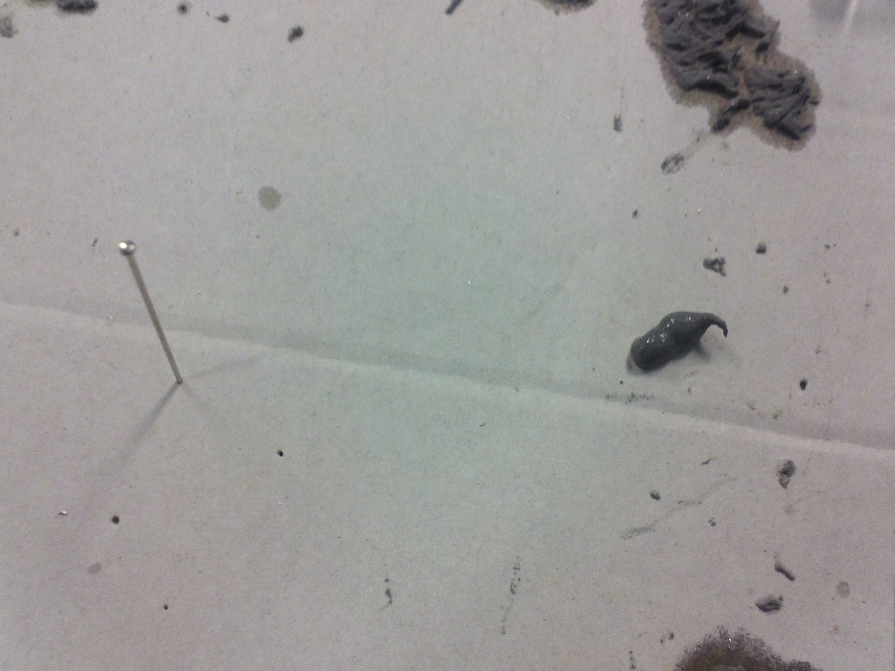

.. _soudureCarteCMS

Souder une carte avec des CMS
=============================

*Ce tutoriel a été fait à l'origine pour une ancienne carte de comm rhoban, le
but de celui-ci est donc de fournir des informations génériques sur la soudure
au four à refusion. Il n'a pas vocation à être un guide absolu, mais plutôt à
prendre en main facilement la soudure au four.*

Matériel nécessaire
-------------------
Pour la première étape (soudure des composants CMS), il faut :

* Pâte à souder
* Un petit carton pour déposer la pâte à souder
* Épingles pour étaler pâte
* Pince à épiler pour poser les composants
* Four pour la soudure
* Tous les composants CMS
* Une loupe (pas nécessaire mais très pratique)
* Une sonde pour la température du four
* Un schéma de la carte à souder

Pour la seconde étape (nettoyage des soudures + finalisation de la carte), il
faut :

* Fer à souder
* Fil de soudure
* Tresse à dessouder
* Les composants DIL restants
* Un multimètre

Soudure au four
---------------

Il faut commencer par charger le schéma de la carte sur son ordinateur.
(l'idéal est d'utiliser le .brd sous eagle, mais une image exportée peut aussi
convenir)

Ensuite, il faut déposer une noisette de pâte à souder sur un carton :

Ensuite, on commence par disposer les résistances aux endroits appropriés.
L'ordre n'est pas particulièrement important, mais comme on a tendance à
déplacer certains des composants au fur et à mesure qu'on place les suivants,
il est conseillé de commencer par les plus faciles (résistances,
condensateurs) et de terminer par les plus durs à placer (processeur, etc).
Généralement, moins les pattes sont espacées, plus le composant est dur à
placer.

Pour les résistances, on peut placer une petite pointe de pâte à souder sur
chaque contact, mais pour les composants dont les pattes sont très proches, il
est conseillé de laisser une traînée de pâte fine le long des connecteurs.

*TODO images à refaire pour cette partie*

Il faut ensuite vérifier que la pâte est bien répartie et que les pattes sont
bien placées par rapport aux connecteurs.

*TODO images illustrant bien/pas bien*

Il est fortement conseillé de faire vérifier la carte à quelqu'un d'autre
avant de la passer au four, les corrections étant plus facile à faire avant
d'avoir passer la carte au four.

Une fois la carte bien validée, on peut commencer la cuisson :

1) Placer la carte sur la grille et la sonde proche de la carte.
2) Monter la température à 125°C
3) Attendre une minute (à partir du moment où la carte a atteint 125°C)
4) Monter la température à 200 degrés
5) Attendre que la pâte se liquéfie partout (moins de 15 secondes en général)
6) Éteindre le four et ouvrir légèrement la porte (le refroidissement ne doit
   pas être trop brutal) attendre que la température redescende.
7) Sortir la carte (Attention c'est chaud)

Finalisation de la carte
------------------------

Il y a principalement trois problèmes possibles après la soudure au four :

* La pâte à souder n'a pas bien fondu
* Courts-circuits
* Faux-contacts

Ils peuvent tous être réparés assez facilement, mais cela prend rapidement du
temps, c'est pour cette raison qu'il est important de bien soigner la soudure
au four.

Fonte de la pâte
++++++++++++++++
Si la pâte à souder n'a pas bien fondu à certains endroits, il faut faire
fondre celle-ci au fer à souder, il n'est pas nécessaire de chauffer
directement la pâte, en chauffant les points de contacts sur la carte et les
pattes, on obtiendra le résultat attendu. Ce problème se présente quand la
carte a été retirée trop tôt.

Courts-circuits
+++++++++++++++
Des courts-circuit se présentent généralement lorsque l'on a utilisé trop de
pâte, ils apparaissent fréquemment sur les composants dont les pâtes sont peu
espacées. Pour les détecter, il faut utiliser le multimètre. Pour régler ce
genre de problèmes là, il faut poser la tresse à dessouder sur la zone où il
y a trop de soudure et chauffer au fer à souder, la tresse *aspirera*
naturellement le surplus de soudure (parfois, il suffit de chauffer un peu les
pattes au fer à souder pour résoudre le problème). Il ne faut pas oublier de
vérifier au Multimètre que le contact ait bien été supprimé (même si on ne le
voit plus à la loupe).

Faux-contacts
+++++++++++++
Parfois, certains endroits manquaient de pâte à souder et le contact avec la
patte ne s'est pas bien fait. On peut détecter cela grâce à la loupe, mais
aussi en vérifiant au multimètre s'il y a bien un contact entre deux pattes
qui doivent être connectées (en touchant uniquement les pattes et pas les
connecteurs). Pour régler ce problème, il suffit d'ajouter un peu de soudure
en faisant chauffer la patte et le point de contact. (Attention à ne pas creer
de faux contacts)

Les composants DIL
++++++++++++++++++

Souvent, tous les composants ne sont pas CMS, dans ce cas, il faut terminer la
carte en ajoutant tous les composants DIL et revérifier que l'on a pas créé de
court-circuits.

Il ne reste ensuite plus qu'à tester la carte.
